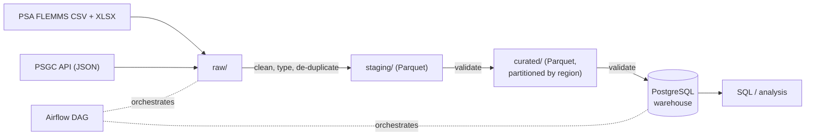

# FLEMMS 2024 Digital Divide & Functional Literacy Pipeline

An automated, containerised data pipeline that turns the Philippine Statistics Authority's **2024 Functional Literacy, Education and Mass Media Survey (FLEMMS)** public-use files into validated, analysis-ready tables in PostgreSQL, orchestrated by Apache Airflow.

DSS150P Data Engineering project.

---

## 1. Problem statement

> Is there a digital divide between age groups, regions and education levels in the Philippines, and to what extent is it related to the functional literacy of the population?

The PSA publishes FLEMMS as raw, coded microdata spread over several files, with weights that must be applied correctly and codes that must be looked up in a separate dictionary. Answering the question needs those files cleaned, joined, labelled and checked, and the same work repeated every time PSA releases a new round (every 3 years) or updates the geographic codes. That is a pipeline problem, not a one-off analysis.

**Stakeholders / consumers**

| Who | Use of the data product |
|---|---|
| Education policymakers (e.g. DepEd) | Where functional literacy is lowest, and whether low digital access goes with it |
| ICT / connectivity programmes (e.g. DICT) | Which regions and groups lack home internet and devices |
| Regional planners, researchers, NGOs | Ready-made weighted rates by region, age group and access tier; person-level table for their own analysis |
| Data scientists on the team | Clean, documented, partitioned dataset instead of raw survey codes |

**Objectives**

1. Ingest the FLEMMS 2024 files and an official region list automatically and reproducibly.
2. Clean, de-duplicate, validate and integrate them through raw → staging → curated layers.
3. Load a modelled, constrained warehouse in PostgreSQL that answers the research question with survey-weighted queries.
4. Orchestrate everything with Airflow inside Docker so anyone can rebuild it from this repository.

**Expected data product:** the curated tables `household`, `member`, `literacy_assessment`, `dim_region`, `agg_literacy_digital` (PostgreSQL + Parquet) and the person-level `person_profile` (Parquet, partitioned by region).

**Scope:** FLEMMS 2024 public-use file (all four record types), PSGC regions. **Out of scope for now:** individual-level internet use and digital skills (FLEMMS Form 3), earlier FLEMMS rounds, sub-provincial geography (not in the public-use file).

## 2. Team

| Member | Role | Main responsibilities |
|---|---|---|
| Claudia Martin | Data Scientist / Analyst | Problem framing and stakeholders, source profiling, analysis and interpretation of results |
| Jenna Valerio | Data Engineer (pipeline and data quality) | Ingestion, staging and curated transformations, data contract and validation, PostgreSQL model |
| David Memorando | Data Engineer (orchestration and deployment) | Airflow DAG, Docker environment, repository, live demonstration |

## 3. What the pipeline found

Survey-weighted, persons 10-64 (from `sql/02_representative_queries.sql`):

| Household digital access tier | Functional literacy rate |
|---|---:|
| No access | 53.6% |
| Low | 68.3% |
| Moderate | 77.4% |
| High | 83.0% |

- National figures reproduce PSA's published 2024 results exactly, which confirms the joins and survey weights are applied correctly ([PSA press release](https://psa.gov.ph/content/every-10-filipinos-9-have-basic-literacy-while-7-have-functional-literacy)):

  | Persons 10-64 | This pipeline | PSA published |
  |---|---:|---:|
  | Estimated population | 85.00 million | 85.00 million |
  | Functionally literate | 60.17 million | 60.17 million |
  | Functional literacy rate | 70.8% | 70.8% |
  | Basic literacy rate | 93.1% | 93.1% |

- Home internet ranges from **53.1%** of households in NCR to **6.3%** in BARMM.
- People in urban areas are far more likely to live with home internet (44.3%) than in rural areas (25.5%); functional literacy is 74.4% vs 66.3%.
- Both digital access and literacy rise with education level.

These are associations from a cross-sectional survey, not proof that internet access causes literacy; income and education affect both.

## 4. Data sources

| # | Source | Format | How it is retrieved |
|---|---|---|---|
| 1 | PSA FLEMMS 2024 public-use file (household, RTF1, member, RTF2) + data dictionary | CSV + XLSX | Downloaded once from the PSA catalog (login and terms of use required), then registered automatically |
| 2 | PSGC regions API | JSON (REST) | Fetched automatically on every run, with retries and a cached fallback |

PSA's catalog lists the 2024 public-use file as Volume 1 and Volume 2. We downloaded both: they contain identical files (the same four CSVs, file names and sizes), so the pipeline ingests one copy. Ingesting both would duplicate every record, which the staging duplicate check (1% limit) would stop. The raw folder and file names keep PSA's original names (`PHL-PSA-FLEMMS-2024-V1-PUF`, `FLEMMS PUF 2024 Volume1 - …`) because the raw layer stores files exactly as received.

1,616,326 survey records in total. Full inventory, profiling and data-quality issues: [docs/source_inventory.md](docs/source_inventory.md).

## 5. Architecture



Full diagram: [docs/images/architecture.png](docs/images/architecture.png). Details, component roles and design trade-offs: [docs/architecture.md](docs/architecture.md). Lineage and transformation rules: [docs/data_flow.md](docs/data_flow.md). Database diagram: [docs/erd.md](docs/erd.md).

**Technology stack:** Python 3.12 (pandas 3, pyarrow), PostgreSQL 16, Apache Airflow 3.3.2, Docker Compose, pytest, Git/GitHub.

## 6. Repository structure

```text
├── config/pipeline.yaml        # non-secret settings: sources, keys, business rules, load plan
├── dags/flemms_pipeline.py     # Airflow DAG
├── data/                       # raw / staging / curated layers (contents not committed)
├── docs/                       # architecture, data flow, ERD, data dictionary, data contract, sources
│   └── images/                 # PNG versions of the diagrams (python docs/render_diagrams.py)
├── outputs/                    # generated reports: validation, profiling, de-dup, format benchmark
├── sql/                        # schema (DDL) and representative queries
├── src/
│   ├── extract/                # PSGC API fetch, survey file ingestion
│   ├── transform/              # staging (clean/de-dup) and curated (join/derive)
│   ├── validation/             # contract-driven data-quality checks
│   ├── load/                   # PostgreSQL loader
│   ├── analysis/               # profiling, file-format benchmark
│   ├── utils/                  # logging and file helpers
│   └── config.py               # reads config/pipeline.yaml and environment variables
├── tests/                      # unit tests (pytest)
├── pipeline.py                 # run the same stages without Airflow
├── Dockerfile                  # Airflow image + project dependencies
├── docker-compose.yml          # Airflow, Airflow DB, warehouse DB
├── .env.example                # configuration template (copy to .env)
└── requirements.txt            # pinned Python dependencies
```

## 7. Setup and running

### Prerequisites

- [Docker Desktop](https://www.docker.com/products/docker-desktop/) (Windows/macOS) or Docker Engine + Compose v2 (Linux), with at least 4 GB of memory for Docker
- Git
- Optional, only to run without Docker: Python 3.12

### Step 1: Get the code

```bash
git clone https://github.com/memorandavid-dotcom/flemms_digital_divide_project.git
cd flemms_digital_divide_project
```

### Step 2: Get the data

1. Sign in to the PSA microdata catalog, open **Functional Literacy, Education and Mass Media Survey 2024 Volume 1** (study ID `PHL-PSA-FLEMMS-2024-V1-PUF`), accept the terms and download the files.
2. Put them in `data/raw/PHL-PSA-FLEMMS-2024-V1-PUF/`, so the folder contains:

```text
FLEMMS PUF 2024 Volume1 - HOUSEHOLD.CSV
FLEMMS PUF 2024 Volume1 - MEMBER.CSV
FLEMMS PUF 2024 Volume1 - RTF1.CSV
FLEMMS PUF 2024 Volume1 - RTF2.CSV
flemms_2024_v1_metadata(dictionary).xlsx
```

The survey files are not in Git (PSA terms of use, and their size). The region list is downloaded automatically.

### Step 3: Configure

```bash
cp .env.example .env        # Windows Command Prompt: copy .env.example .env
```

Open `.env` and replace every `change_me`. All settings:

| Variable | Purpose |
|---|---|
| `AIRFLOW_IMAGE_NAME` | Name of the image built from the Dockerfile |
| `AIRFLOW_UID` | User Airflow runs as inside containers (50000 is fine on Windows/macOS; on Linux use `id -u`) |
| `AIRFLOW_DB_USER` / `_PASSWORD` / `_NAME` | Airflow's own metadata database |
| `_AIRFLOW_WWW_USER_USERNAME` / `_PASSWORD` | Login for the Airflow web UI |
| `AIRFLOW_JWT_SECRET` | Any long random string |
| `WAREHOUSE_DB` / `_USER` / `_PASSWORD` | Project PostgreSQL database |
| `WAREHOUSE_HOST` / `WAREHOUSE_PORT` | Where `pipeline.py` finds the warehouse when run outside Docker (`localhost` / `5433`) |
| `PSGC_API_BASE_URL` | Base URL of the PSGC API |

Non-secret settings (file names, keys, age groups, access tiers, partition column) are in `config/pipeline.yaml`.

### Step 4: Start the services

```bash
docker compose up -d --build
```

The first build takes a few minutes. Check that everything is healthy:

```bash
docker compose ps
```

| Service | What it is | Address |
|---|---|---|
| airflow-apiserver | Airflow web UI and API | <http://localhost:8080> |
| airflow-scheduler, airflow-dag-processor | Run and parse the DAG | — |
| airflow-db | Airflow metadata (PostgreSQL) | internal |
| warehouse-db | Project warehouse (PostgreSQL) | `localhost:5433` |

### Step 5: Run the pipeline

**With Airflow (normal way):** open <http://localhost:8080>, log in with the `_AIRFLOW_WWW_USER_*` values from `.env`, open `flemms_digital_divide_pipeline`, switch it on and press **Trigger**. Use *Trigger with config* to set `run_format_benchmark` to false for a faster run. A full run takes about 5-7 minutes on Docker Desktop for Windows.

Or from a terminal:

```bash
docker compose exec airflow-scheduler airflow dags unpause flemms_digital_divide_pipeline
docker compose exec airflow-scheduler airflow dags trigger flemms_digital_divide_pipeline
```

**Without Airflow:** the same stages, in a container:

```bash
docker compose run --rm pipeline-cli python pipeline.py               # all stages
docker compose run --rm pipeline-cli python pipeline.py --list        # stage names
docker compose run --rm pipeline-cli python pipeline.py --stages staging validate_staging
```

or on your machine with Python 3.12 (`python -m venv .venv`, activate it, `pip install -r requirements.txt`, then `python pipeline.py`). The warehouse container must be running for the `load` stage.

### Step 6: Initialise and query PostgreSQL

The schema is created automatically by the `load_warehouse` task (`sql/01_create_schema.sql`, safe to re-run). To query:

```bash
docker compose exec warehouse-db psql -U flemms -d flemms                                          # interactive
docker compose exec warehouse-db psql -U flemms -d flemms -f /sql/02_representative_queries.sql    # all sample queries
```

(Use your `WAREHOUSE_USER` / `WAREHOUSE_DB` if you changed them.) GUI tools such as DBeaver or pgAdmin can connect to `localhost:5433`.

### Step 7: Run the tests

```bash
docker compose run --rm pipeline-cli pytest
```

### Stopping

```bash
docker compose down        # stop; database contents are kept
docker compose down -v     # stop and delete both databases
```

## 8. The Airflow DAG

```text
ingest_survey_files ──> profile_raw_sources
        │
        v
build_staging ──> validate_staging ──> build_curated ──> validate_curated ──> load_warehouse
                                            ^                      └──────> benchmark_file_formats
fetch_region_codes ─────────────────────────┘
```

| Setting | Value | Why |
|---|---|---|
| Schedule | `@monthly`, no catch-up | Picks up a new survey file or PSGC change; reruns are safe |
| Retries | 2, exponential backoff from 1 minute | Rides out network or database blips |
| Data-quality failures | Fail immediately, no retry (`AirflowFailException`) | Retrying the same bad data cannot succeed |
| `on_failure_callback` | Logs task, run, try number and error | One line to find in the logs |
| `max_active_runs` | 1 | Two runs never write the same files at once |
| Parameter `run_format_benchmark` | true/false | Skip the slow benchmark when not needed |

**Diagnosing a failure:** in the Airflow UI open the run, click the red task, open **Logs**. Logs are also on disk under `logs/dag_id=flemms_digital_divide_pipeline/`. Validation failures name the table, check, column and count, e.g.
`DataQualityError: 1 data-quality check(s) failed in 'staging': v1_household.row_count(*): 177,656 rows (minimum 10,000,000)`.
The full list of checks for the last run is in `outputs/validation/<stage>_latest.json`.

## 9. Data quality and validation

Rules live in [docs/data_contract.yaml](docs/data_contract.yaml); `src/validation/checks.py` enforces them after staging (117 checks) and after curation (177 checks). Ten check types:

| Check | Example |
|---|---|
| row_count | `household` has at least 100,000 rows |
| required_columns (schema) | every contracted column exists |
| dtype | `age` is an integer, `has_home_internet` is boolean |
| not_null | `hhid`, weights, `sex` never missing |
| unique | no duplicate `hhid`, no duplicate `(hhid, line_no)` |
| exact_duplicates | no fully repeated rows |
| accepted_values | `urbanity` in {Urban, Rural, No official classification} |
| range | age 0-98, digital_access_score 0-5, rates 0-100 |
| foreign_key | every literacy record has a member; every member a household; every household a region |
| row_reconciliation | raw rows = staged rows + duplicates removed |

PostgreSQL enforces the same keys and ranges again with `PRIMARY KEY`, `FOREIGN KEY` and `CHECK` constraints.

**Duplicates:** staging removes fully repeated rows and repeated keys, saves any removed rows to `data/staging/_rejects/` and writes counts to `outputs/staging/dedup_report.json`. It stops if more than 1% of a file is duplicated (usually a wrong key or a broken download). The FLEMMS 2024 files contain **no** duplicates; the checks still run every time.

## 10. Rerun safety (idempotency)

| Layer | Strategy |
|---|---|
| raw | Never modified; each run writes a manifest with checksums and flags any file that changed |
| staging / curated | Each table file is overwritten; the partitioned folder is deleted and rewritten, so no stale partitions remain |
| PostgreSQL | One transaction per load: delete the survey year's rows, bulk-insert (COPY), commit; `dim_region` uses UPSERT. Any error rolls everything back |
| audit | Every load adds a row to `pipeline_run` |

Demonstration: trigger the DAG twice, then run query 1 in `sql/02_representative_queries.sql`. Row counts stay at 177,656 / 650,424 / 610,590 and `pipeline_run` shows two loads.

## 11. File formats and partitioning

| Format | Where it is used |
|---|---|
| CSV | Source survey files; small CSV copy of the aggregate (`outputs/agg_literacy_digital.csv`) |
| JSON | PSGC API response, ingestion manifests, validation and de-dup reports |
| XLSX | PSA data dictionary (parsed into the staged codebook) |
| Parquet | Staging and curated layers |

Measured on the 650,424-row person table (`outputs/format_comparison.md`): Parquet is about **9 MB vs 147 MB for CSV and 485 MB for JSON**, reads in about 0.1 s vs 3 s (CSV) and 12 s (JSON), and is the only format that keeps the column types.

`person_profile` is partitioned by `region_code` because the research question compares regions and analysts usually filter by region. Reading NCR only touches 1 of 17 partition folders:

```python
from src.transform.curated import read_person_profile
ncr = read_person_profile(region_code=13)   # reads only data/curated/person_profile/region_code=13/
```

## 12. Expected outputs

| Output | Location |
|---|---|
| Ingestion manifest (checksums, rows, encoding) | `data/raw/_manifests/latest.json` |
| Staged tables + codebook | `data/staging/*.parquet` |
| Curated tables | `data/curated/*.parquet`, `data/curated/person_profile/region_code=*/` |
| Warehouse tables and view | PostgreSQL `flemms` database |
| Profiling report | `outputs/profiling/profiling_report.md` |
| De-duplication report | `outputs/staging/dedup_report.json` |
| Validation reports | `outputs/validation/staging_latest.json`, `curated_latest.json` |
| Format comparison | `outputs/format_comparison.md` |
| Aggregate for spreadsheets | `outputs/agg_literacy_digital.csv` |

## 13. Assumptions and limitations

- The survey files must be downloaded by hand once (PSA login and terms of use).
- Digital access in the FLEMMS 2024 public-use file is measured per **household**, so every member of a household gets the same access tier. Individual-level data (FLEMMS Form 3) would allow individual digital measures.
- The digital access score and tiers are our own business rule (documented in `config/pipeline.yaml` and `docs/data_flow.md`), not a PSA indicator.
- Public-use files stop at province level; regional estimates follow the survey design, smaller areas are not reliable.
- Rates in `agg_literacy_digital` cells with few sampled persons are unstable.
- The PSGC API snapshot has no Negros Island Region yet, so analysis uses `REG` (17 regions); `REG2` is kept.
- Results show association, not causation.

## 14. Troubleshooting

| Problem | Fix |
|---|---|
| `ingest_survey_files` fails with "No file matching …" | The survey CSVs are not in `data/raw/PHL-PSA-FLEMMS-2024-V1-PUF/` (see Step 2) |
| `fetch_region_codes` warns "Using cached snapshot" | The PSGC API was unreachable; the last saved copy was used. Re-run later |
| `Missing environment variables [...]` | `.env` is missing or incomplete; copy `.env.example` and fill it in |
| Port 8080 or 5433 already in use | Stop the other program, or change the port in `docker-compose.yml` / `WAREHOUSE_PORT` |
| Airflow UI does not load right after `up` | Wait about a minute; `docker compose ps` should show the services as healthy |
| DAG not visible | `docker compose exec airflow-scheduler airflow dags list-import-errors` |
| Strange errors after cloning on Windows | Make sure Git did not convert line endings; this repo's `.gitattributes` forces LF, re-clone if needed |
| Need a completely fresh start | `docker compose down -v`, delete `data/staging`, `data/curated`, then `docker compose up -d --build` |

## 15. Future improvements

- Add individual-level internet use and digital skills (FLEMMS Form 3) if PSA releases them.
- Add earlier FLEMMS rounds (2019) to compare trends; the `survey_year` keys already allow it.
- Include the Negros Island Region once the PSGC API publishes it.
- Report standard errors / confidence intervals using the PSU design variables.
- A dashboard on top of `agg_literacy_digital`.
- Continuous integration (run `pytest` on every push).

## 16. Acknowledgements

Data: Philippine Statistics Authority, *2024 Functional Literacy, Education and Mass Media Survey, Public-Use File Volume I*. Region codes: PSGC API (<https://psgc.gitlab.io/api/>), based on PSA's Philippine Standard Geographic Code. Docker Compose setup adapted from the official Apache Airflow 3.3.2 `docker-compose.yaml`.
