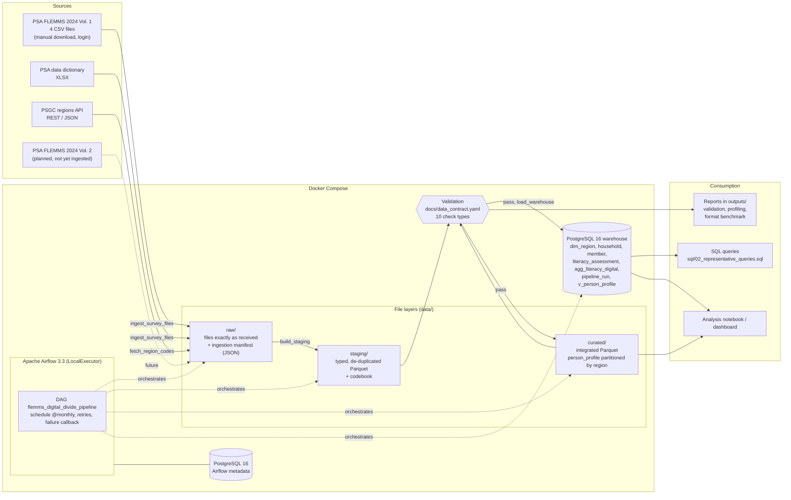

# Architecture

The diagram shows the system as implemented in this repository. Every box maps to a file or a Docker service.

## Components and why they were chosen

| Component | Role | Why this choice |
|---|---|---|
| **Python 3.12 + pandas / pyarrow** | All extraction, cleaning, joining and validation code in `src/` | The data (≈1.6 million rows) fits comfortably in memory; pandas is what the team knows; pyarrow gives fast Parquet and partitioned datasets. |
| **Raw / staging / curated folders** | Layered storage under `data/` | Raw keeps the source untouched for traceability; staging isolates per-file cleaning; curated holds integrated, analysis-ready tables. A bad step can be re-run from the layer before it. |
| **Parquet** | Staging and curated storage | 16× smaller than CSV for the person table, about 20× faster to read, and it keeps column types (see `outputs/format_comparison.md`). |
| **Partitioning by `region_code`** | `data/curated/person_profile/region_code=<n>/` | The research question compares regions, so analysts usually filter by region; reading one region touches 1 of 17 folders. |
| **Data contract (YAML)** | `docs/data_contract.yaml`, enforced by `src/validation/checks.py` | One file is both the documentation and the rule set, so they cannot drift apart. |
| **PostgreSQL 16** | Warehouse for curated tables | Required by the course; primary/foreign keys and CHECK constraints give a second line of defence after Python validation; SQL is the easiest way for other consumers to query. |
| **Apache Airflow 3.3** | Orchestration (`dags/flemms_pipeline.py`) | Dependencies, schedule, retries, parameters and per-task logs out of the box. LocalExecutor is enough for one machine and avoids Redis/Celery. |
| **Docker Compose** | Runs Airflow, its metadata DB and the warehouse | Same versions on every laptop; one command to start (`docker compose up -d --build`). |
| **PSGC API** | Official region names | Replaces a hand-typed region mapping that had errors; retrieved automatically with retries and a cached fallback. |

## Design decisions and trade-offs

- **Survey files are downloaded by hand once.** The PSA catalog requires a login and acceptance of its terms, so automating the download would mean storing credentials and bypassing the terms. Everything after the files land in `data/raw/` is automated, and a missing or changed file is detected (checksums in the ingestion manifest).
- **Two PostgreSQL instances.** Airflow's own metadata is kept separate from project data so that resetting one never touches the other.
- **Files between tasks, not XCom.** Tasks exchange data through the layer folders; XCom only carries small summaries. This keeps the Airflow database small and lets any stage be re-run on its own.
- **Full reload per survey year.** The source is a static survey release, so each run replaces the 2024 rows in one transaction instead of tracking row-level changes. This is simple, fast (≈1 minute) and rerun-safe.
- **The person-level table is not loaded into PostgreSQL.** It is fully derivable from the normalised tables, so the warehouse exposes it as the view `v_person_profile` instead of storing it twice.
