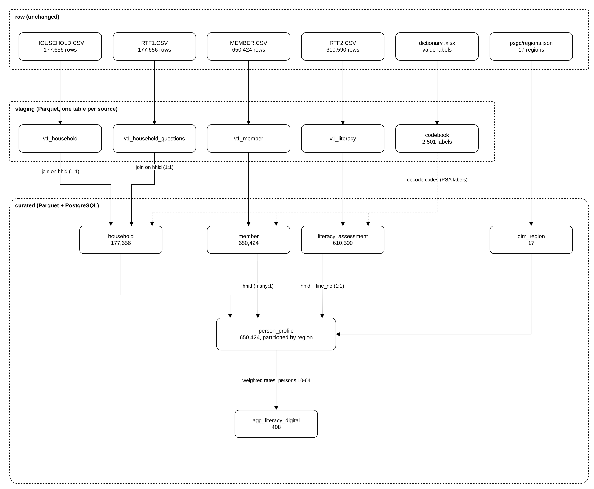

# Data flow and lineage

How each source file moves through the layers, and what happens to it at each step. Editable source: [diagrams/data_flow.drawio](diagrams/data_flow.drawio); to change it, open it at [app.diagrams.net](https://app.diagrams.net) (File → Open from → Device), save it back to the same place, then run `python docs/render_diagrams.py` to refresh the PNG.

## What each layer is allowed to do

| Layer | Allowed | Not allowed |
|---|---|---|
| **raw** | Store files exactly as downloaded / returned by the API; record checksum, size, rows, encoding, time (`data/raw/_manifests/`) | Any edit to the files |
| **staging** | Standardise column names (lower_snake_case, remove BOM); trim spaces; blank → missing; convert all-numeric columns to integer/decimal; remove exact duplicate rows and duplicate keys (rejected rows saved to `data/staging/_rejects/`); add lineage columns `source_file`, `source_line`, `batch_id`, `ingested_at`; parse the codebook | Joins, renaming to business names, derived fields |
| **curated** | Joins across sources; business names; decode codes with the PSA codebook; derived fields and business rules (below); weighted aggregates; partitioning | Changing source values other than by the documented rules |

## Transformation rules

| Rule | Where | Detail |
|---|---|---|
| Yes/no codes | `curated.yes_no` | PSA code 1 → `True`, 2 → `False`, anything else → missing |
| Unknown age | `curated.build_member` | Age 99 means "unknown" in the PSA codebook → missing (28 people) |
| Age groups | `config/pipeline.yaml` → `curated.age_groups` | 0-9, 10-14, 15-24, 25-34, 35-44, 45-54, 55-64, 65+ |
| Home internet | `curated.build_household` | Internet with cable **or** without cable |
| Digital access score | `curated.build_household` | smartphone + computer + tablet + home internet + mobile subscription (0-5) |
| Digital access tier | `config/pipeline.yaml` → `curated.digital_access_tiers` | 0 = No access, 1-2 = Low, 3 = Moderate, 4-5 = High |
| Region names | `curated.build_dim_region` | First two digits of the PSGC 10-digit code = PSA region code (05 Bicol, 17 MIMAROPA, 19 BARMM) |
| Region used for analysis | `curated.build_household` | `reg` (17 regions, matches PSGC). `reg2` (adds Negros Island Region, code 18) is kept as `region_code_nir` |
| Labels | `curated.code_labels` | Taken from the PSA data dictionary; leading codes such as "1 - " are removed |
| Weights | `curated.build_aggregate`, SQL queries | Literacy rates use `respondent_weight` (Form 2); household shares use `household_weight` |
| School attendance | `curated.build_member` | Codes 1-3 (public, private, home-schooled) → `True`; 4 → `False` |

## Tracing one record

Person `hhid = 1, line_no = 1`:

1. **raw** `MEMBER.CSV` line 2 (`HHID=000001, LNO=01`) and `RTF2.CSV` line 2 (`HHID=000001, LNO_F2= 1`)
2. **staging** `v1_member` row with `source_line = 2`; `v1_literacy` row with `source_line = 2` (codes now integers, so `01` and ` 1` both become `1`)
3. **curated** `member`, `literacy_assessment`, `household` rows with `hhid = 1`; `person_profile` partition `region_code=1`
4. **warehouse** `SELECT * FROM v_person_profile WHERE hhid = 1 AND line_no = 1;` (query 8 in `sql/02_representative_queries.sql`)
