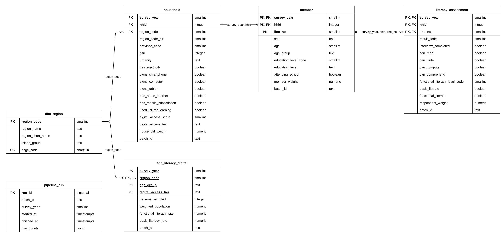

# Warehouse ERD (PostgreSQL)

Created by `sql/01_create_schema.sql`. Keys: **PK** primary key, **FK** foreign key, **UK** unique key. Editable source: [diagrams/erd.drawio](diagrams/erd.drawio); to change it, open it at [app.diagrams.net](https://app.diagrams.net) (File → Open from → Device), save it back to the same place, then run `python docs/render_diagrams.py` to refresh the PNG.

Not every column is drawn (e.g. `owns_basic_phone`, `has_internet_cable`, `result`); the full list is in [data_dictionary.md](data_dictionary.md).

## Relationships

| From | To | Cardinality | Meaning |
|---|---|---|---|
| `household.region_code` | `dim_region.region_code` | many → one | Each household is in one region |
| `member (survey_year, hhid)` | `household` | many → one | Each person belongs to one household; every household has at least one member |
| `literacy_assessment (survey_year, hhid, line_no)` | `member` | one → one (optional) | Persons 5+ covered by Form 2 have one assessment row; younger children have none |
| `agg_literacy_digital.region_code` | `dim_region` | many → one | Aggregates are per region |

`pipeline_run` is an audit table with no foreign keys. The view `v_person_profile` joins member, household, dim_region and literacy_assessment.

## Why this design

- **Natural composite keys** (`survey_year, hhid, line_no`) come straight from the survey, so a record can be traced back to the source file without a lookup table. `survey_year` is part of every key so a future FLEMMS round can be loaded next to 2024.
- **Normalised tables + one view** instead of one wide table: household attributes are stored once (177,656 rows) instead of repeated for every member (650,424 rows).
- **Constraints mirror the data contract** (`CHECK` on ages, scores, rates, tiers; `NOT NULL` where the contract says `nullable: false`), so bad data is rejected even if someone loads it without the Python validation.
